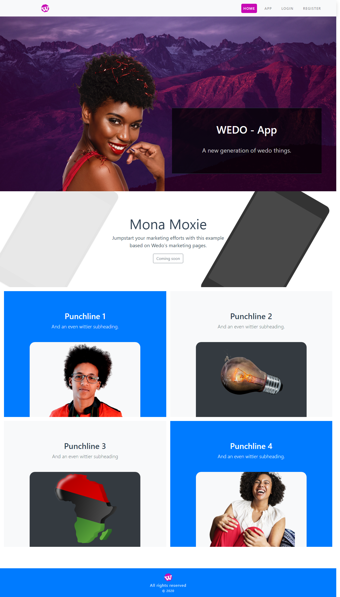

A simple Single Page Application task setter built with Laravel/Vuejs. Designed to be simple, efficient and easily scalable. Supports API authentication with Laravel Passport
 
# Technology Stack

* PHP/Laravel
* JavaScript/Vue Js
* Twitter Bootstrap
* Animate CSS 

# TODO

* Render history graphs for tasks
* Group tasks by date
* Group tasks by priorites
* Enable tags and catgories
 

 

# LICENSE 
MIT License

